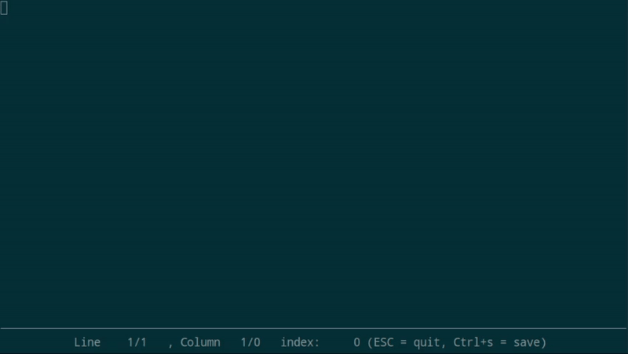

# vee

V Editor Engine

This is a V module providing the guts of a text editor.

Progammed to make it easier, faster and richer to develop editors, text areas, consoles for games etc.

## Features

* Multiple buffers
* Full undo/redo support
* Cursor magnet
* Movement by words
